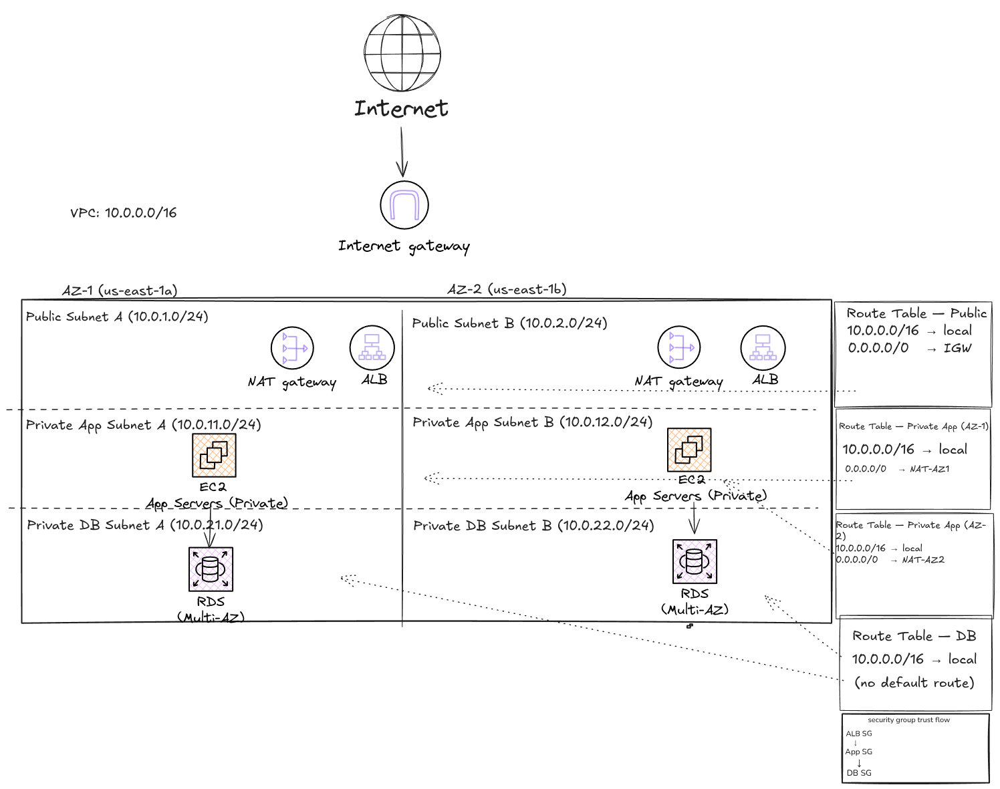

# Secure AWS Infrastructure Baseline

## Purpose
## Architecture Overview
## Security Objectives

This project demonstrates a secure AWS infrastructure baseline focused on translating RMF/NIST security intent into deployable AWS controls.

- Enforce private-by-default infrastructure design
- Segment public, private application, and private data tiers
- Use IAM and SSM for administrative access instead of inbound SSH
- Control traffic flow using route tables, security groups, and NACLs
- Capture audit evidence using CloudTrail, CloudWatch, AWS Config, and S3 log storage
- Protect logs and data using KMS, S3 encryption, EBS encryption, and CloudTrail log validation

## Architecture Diagram

## Services Used
## Terraform Structure
## Deployment Steps
## Validation Steps
## Controls Implemented
## Cost Notes
## Architecture Diagram
## Lessons Learned
